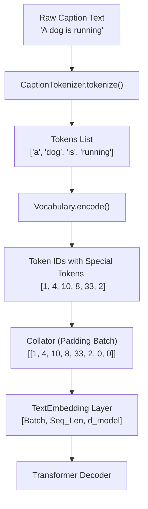

# Tách Từ (Tokenization) và Mã Hóa Caption (Text Encoding) trong Image Captioning Transformer

Tài liệu này giải thích chi tiết về quy trình **Tách từ (Tokenization)** và **Mã hóa văn bản (Text Encoding)** trong dự án Image Captioning Transformer, bao gồm cơ chế hoạt động, ví dụ minh họa và **lý do tại sao** các kỹ sư Machine Learning phải thực hiện các bước này.

---

## 📌 1. Tổng Quan và Mục Đích

Trong bài toán **Image Captioning (Mô tả hình ảnh bằng văn bản)**, mô hình Transformer nhận đầu vào là một bức ảnh và có nhiệm vụ sinh ra một câu mô tả tự nhiên bằng tiếng Anh (ví dụ: *"a dog is running on the grass"*).

tuy nhiên, các mô hình Deep Learning và mạng nơ-ron **không thể làm việc trực tiếp với văn bản dạng chuỗi ký tự (String)**. Chúng chỉ hiểu và tính toán trên các ma trận con số (Tensors/Vectors).

Do đó, chúng ta cần một quy trình biến đổi câu văn bản qua 2 bước chính:
1. **Tokenization (Tách từ):** Chuyển câu văn bản tự nhiên thành danh sách các đơn vị từ (tokens).
2. **Numerical Encoding (Mã hóa số):** Chuyển từng token thành một chỉ số nguyên (Token ID) dựa trên một bảng Từ điển (Vocabulary) cố định.

```
+------------------------------------+
|  Văn bản thô (Raw Caption Text)    |
|  "A dog is running on the grass."  |
+------------------------------------+
                  |
                  v  (Step 1: Tokenization)
+------------------------------------+
|  Danh sách Tokens                  |
|  ['a', 'dog', 'is', 'running', ...] |
+------------------------------------+
                  |
                  v  (Step 2: Vocabulary Lookup & Encoding)
+------------------------------------+
|  Danh sách Token IDs (Tensor)      |
|  [1, 4, 10, 8, 33, 7, 4, 158, 2]     |
+------------------------------------+
```

---

## 🎯 2. Tại Sao Cần Tách Từ và Mã Hóa Thành Token?

### 2.1. Máy tính chỉ tính toán trên các con số
Mạng nơ-ron sử dụng các phép nhân ma trận ($Y = X \cdot W + b$) và hàm kích hoạt để xử lý thông tin. Do đó, các từ như `"dog"`, `"cat"` phải được đại diện bằng một con số ID duy nhất (ví dụ: `"dog"` $\to$ `10`, `"cat"` $\to$ `25`). Các ID này sau đó được truyền qua lớp `TextEmbedding` để đổi thành các vector nhiều chiều chứa ngữ nghĩa.

### 2.2. Chuẩn hóa ngôn ngữ (Normalization)
Văn bản đầu vào từ con người rất đa dạng: viết hoa, viết thường, có dấu chấm, dấu phẩy, khoảng trắng thừa...
- Tách từ giúp chuyển tất cả về dạng chữ thường (`lowercase`) để từ `"Dog"` và `"dog"` được coi là **cùng một từ**, tránh việc mô hình phải học hai vector riêng biệt cho cùng một ý nghĩa.
- Bỏ qua các dấu câu không cần thiết để mô hình tập trung vào nội dung chính của bức ảnh.

### 2.3. Quản lý dung lượng từ điển (Vocabulary Size)
Nếu không mã hóa và giới hạn từ điển:
- Mô hình sẽ bị phình to vì chứa hàng trăm ngàn từ hiếm hoặc từ gõ sai chính tả.
- Việc giới hạn từ điển với tần suất tối thiểu (`min_frequency`) giúp mô hình học tập trung vào các từ phổ biến, tránh hiện tượng học vẹt (**Overfitting**).

### 2.4. Đánh dấu cấu trúc câu bằng Thẻ Đặc Biệt (Special Tokens)
Một câu không chỉ gồm các từ thông thường mà còn cần các tín hiệu điều khiển luồng:
- Mô hình cần biết **khi nào câu bắt đầu** để bắt đầu sinh từ.
- Mô hình cần biết **khi nào câu kết thúc** để dừng phát sinh từ mới.
- Các câu trong cùng một Lô (Batch) có độ dài khác nhau cần được **san bằng độ dài** để ghép thành Tensor hình chữ nhật.

---

## 🔍 3. Chi Tiết Quy Trình 1: Tách Từ (`CaptionTokenizer`)

Mã nguồn được cài đặt tại [data/tokenizer.py](file:///Users/nanphghihi/.gemini/antigravity-ide/scratch/image-captioning-transformer-model/data/tokenizer.py).

### 3.1. Cơ chế hoạt động
Lớp `CaptionTokenizer` sử dụng biểu thức chính quy (Regular Expression - Regex) để trích xuất các từ:

```python
class CaptionTokenizer:
    TOKEN_PATTERN = re.compile(r"[a-z0-9]+(?:'[a-z0-9]+)?")

    def tokenize(self, caption: str) -> list[str]:
        normalized_caption = caption.lower().strip()
        return self.TOKEN_PATTERN.findall(normalized_caption)
```

1. **Chuẩn hóa chữ thường:** `lower()` chuyển tất cả ký tự về dạng chữ thường.
2. **Regex Matching:** `r"[a-z0-9]+(?:'[a-z0-9]+)?"` 
   - Tìm các chuỗi gồm chữ cái (`a-z`) và chữ số (`0-9`).
   - Hỗ trợ các từ viết tắt có dấu nháy đơn tiếng Anh như `don't`, `it's`, `girl's`.

### 3.2. Ví dụ minh họa
- **Đầu vào:** `"A black dog is running in the grass !"`
- **Đầu ra (`tokens`):** `['a', 'black', 'dog', 'is', 'running', 'in', 'the', 'grass']`

---

## 📚 4. Chi Tiết Quy Trình 2: Xây Dựng Từ Điển (`Vocabulary`)

Mã nguồn được cài đặt tại [data/vocabulary.py](file:///Users/nanphghihi/.gemini/antigravity-ide/scratch/image-captioning-transformer-model/data/vocabulary.py).

### 4.1. Bộ Thẻ Đặc Biệt (Special Tokens)
Từ điển khởi tạo sẵn 4 thẻ đặc biệt tại các vị trí ID từ `0` đến `3`:

| Token | ID | Tên đầy đủ | Mục đích / Ý nghĩa |
| :--- | :---: | :--- | :--- |
| `<PAD>` | **0** | Padding Token | Đệm vào cuối các câu ngắn hơn để tất cả câu trong Batch có cùng độ dài. |
| `<BOS>` | **1** | Beginning Of Sequence | Đánh dấu bắt đầu câu. Làm đầu vào mồi (prompt) cho Decoder ở bước suy luận đầu tiên. |
| `<EOS>` | **2** | End Of Sequence | Đánh dấu kết thúc câu. Khi Decoder sinh ra ID = 2, tiến trình sinh caption dừng lại. |
| `<UNK>` | **3** | Unknown Token | Thay thế cho các từ không nằm trong từ điển (từ hiếm hoặc từ mới lúc inference). |

### 4.2. Xây dựng Vocabulary từ tập huấn luyện (`build_from_json`)
Để tránh hiện tượng **Rò rỉ dữ liệu (Data Leakage)**, Vocabulary **chỉ được xây dựng duy nhất từ tập Train (`train.json`)**, tuyệt đối không dùng dữ liệu từ tập Validation hay Test.

Quy trình xây dựng:
1. Duyệt qua tất cả caption trong tập Train và dùng `CaptionTokenizer` để tách thành danh sách token.
2. Đếm tần suất xuất hiện của từng từ bằng `collections.Counter`.
3. Lọc các từ có tần suất $\ge$ `min_frequency` (mặc định = 2).
4. Sắp xếp các từ giảm dần theo tần suất và gán cho mỗi từ một chỉ số ID tăng dần từ `4`.

---

## 🔢 5. Chi Tiết Quy Trình 3: Mã Hóa Caption Thành Token IDs (`Vocabulary.encode`)

Hàm `encode()` có nhiệm vụ chuyển chuỗi văn bản tiếng Anh thành danh sách chỉ số ID nguyên:

```python
def encode(self, caption: str, max_length: int | None = None) -> list[int]:
    tokens = self.tokenizer.tokenize(caption)
    
    if max_length is not None:
        # Chừa 2 vị trí cho <BOS> và <EOS>
        tokens = tokens[:max_length - 2]

    token_ids = [
        self.token_to_id.get(token, self.UNK_TOKEN_ID)
        for token in tokens
    ]

    return [
        self.BOS_TOKEN_ID,  # 1
        *token_ids,
        self.EOS_TOKEN_ID   # 2
    ]
```

### Ví dụ từng bước:
Giả sử từ điển có các cặp: `{"a": 4, "girl": 10, "sits": 15}`.

1. **Câu đầu vào:** `"A girl sits."`
2. **Sau khi tokenize:** `['a', 'girl', 'sits']`
3. **Tra cứu ID trong Vocab:** `[4, 10, 15]`
4. **Thêm `<BOS>` vào đầu và `<EOS>` vào cuối:** `[1, 4, 10, 15, 2]`

👉 Kết quả `[1, 4, 10, 15, 2]` chính là mảng đầu vào chuẩn bị đưa vào mô hình Transformer!

---

## 🔄 6. Quy Trình Giải Mã: Từ Token IDs Về Văn Bản (`Vocabulary.decode`)

Khi mô hình Transformer dự đoán ra chuỗi các số ID (ví dụ: `[1, 4, 10, 8, 33, 2, 0, 0]`), hàm `decode()` sẽ chuyển các ID này ngược trở lại thành văn bản đọc được cho con người:

```python
def decode(self, token_ids: list[int], skip_special_tokens: bool = True) -> str:
    tokens = []
    for token_id in token_ids:
        token = self.id_to_token.get(int(token_id), self.UNK_TOKEN)
        if token == self.EOS_TOKEN:  # Dừng lại ngay khi gặp <EOS>
            break
        if skip_special_tokens and token in {self.PAD_TOKEN, self.BOS_TOKEN, self.EOS_TOKEN}:
            continue
        tokens.append(token)
    return " ".join(tokens)
```

- **Kết quả:** `[1, 4, 10, 8, 33, 2, 0, 0]` $\to$ `"a dog is running"` (đã tự động bỏ `<BOS>`, gặp `<EOS>` thì dừng và bỏ qua các thẻ `<PAD>` phía sau).

---

## 🛠 7. Vai Trò Trong Huấn Luyện Transformer (`Teacher Forcing`)

Trong mô hình Image Captioning Transformer, chuỗi Token IDs sau khi mã hóa được tách làm 2 phần cho quá trình huấn luyện:

Cho câu đã mã hóa: `[BOS, a, dog, is, running, EOS]` (Độ dài = 6)

1. **Decoder Input IDs (Đầu vào Decoder):** `[BOS, a, dog, is, running]` (Bỏ từ cuối `<EOS>`)
2. **Target IDs (Nhãn mong muốn dự đoán):** `[a, dog, is, running, EOS]` (Dịch sang phải 1 vị trí, bỏ từ đầu `<BOS>`)

Nhờ việc mã hóa thành các chỉ số ID nguyên chuẩn chỉnh như thế này, hàm tính toán Loss (`CrossEntropyLoss`) của PyTorch mới có thể so sánh xác suất đầu ra của mô hình với nhãn Target một cách chính xác nhất.

---

## 📊 8. Tóm Tắt Luồng Xử Lý Dữ Liệu Văn Bản



---

## 💡 Kết Luận
Việc **Tách từ (Tokenization)** và **Mã hóa thành Token IDs (Encoding)** là cầu nối bắt buộc giữa ngôn ngữ tự nhiên của con người và đại số tuyến tính của máy tính. Thiết kế từ điển chặt chẽ với các thẻ đặc biệt (`<PAD>`, `<BOS>`, `<EOS>`, `<UNK>`) đóng vai trò quyết định giúp mô hình Transformer có thể học và sinh câu mô tả một cách mượt mà và chính xác.
